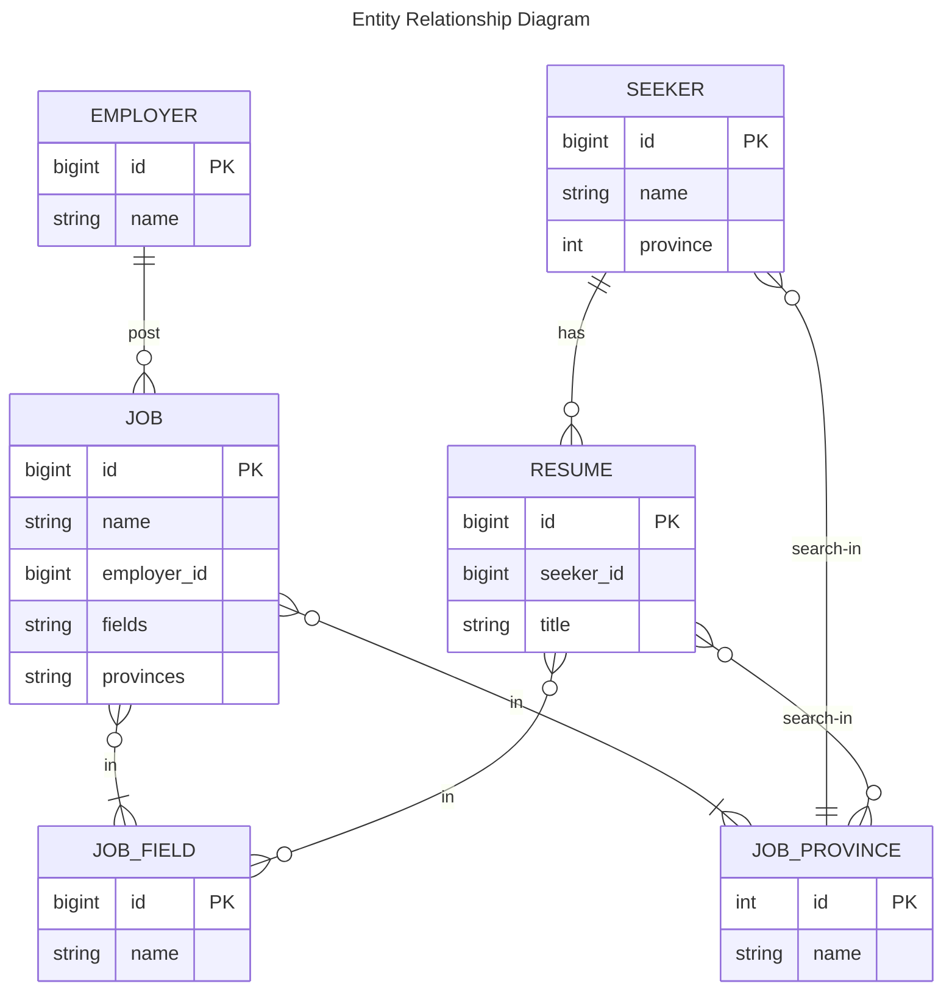

# Requirements of project

<!-- TOC -->
* [Requirements of project](#requirements-of-project)
  * [Bài toán](#bài-toán)
  * [Mô tả](#mô-tả)
  * [Yêu cầu chung](#yêu-cầu-chung)
    * [1. Quy trình làm việc](#1-quy-trình-làm-việc)
    * [2. Response của API](#2-response-của-api)
    * [3. Source code](#3-source-code)
<!-- TOC -->

Trong bài hướng dẫn này chúng ta sẽ làm một project về lĩnh vực tuyển dụng.
Yêu cầu đặt ra là thiết kế và triển khai các API cho hệ thống.

## Bài toán

Đầu vào:

- Database, tables: Chúng ta sẽ làm việc trên một database với các bảng có sẵn và đã có một ít dữ liệu sẵn có.
- Mô tả API: Các mô tả cho từng yêu cầu ở dạng non-technical

Đầu ra:

- Thiết kế API
- API implementation
- API docs
- Linter
- Monitoring service

## Mô tả

Hệ thống bao gồm các entities (có thể hiểu là các bảng) và quan hệ như sau:



**EMPLOYER**

- Người đăng tuyển các công việc
- Một `employer` có thể đăng 0 hoặc nhiều `job`

**JOB**

- Thông tin về công việc
- Một job phải nằm ở 1 hoặc nhiều lĩnh vực `job_filed`
- Một job khi đăng cần chỉ định rõ ở 1 hoặc nhiều tỉnh thành (khu vực) `job_province`

## Yêu cầu chung

### 1. Quy trình làm việc

- Dự án được chia thành các sprints.
- Mỗi sprint sẽ kéo dài từ 1 - 2 tuần.
- Mỗi sprint sẽ gồm nhiều tasks. Chúng ta follow theo hướng dẫn trong thư mục của từng sprint tương ứng.
- Mỗi bạn cần tạo một `repository` trên github cho dự án và add mình vào `repository` này.
- Kết thúc mỗi sprint các bán tiến hành tạo merge request và merge vào nhánh `main`

### 2. Response của API

Response của API trả về dạng json và chúng ta thống nhất dùng format chung như sau:

```
{
  "errorCode": int,
  "statusCode": int,
  "message": string,
  "object": {}
}
```

| Trường     | Mô tả                      |
|------------|----------------------------|
| errorCode  | Mã lỗi                     |
| statusCode | Http status code           |
| message    | Message mô tả lỗi          |
| object     | Object chứa dữ liệu trả về |

Với dữ liệu paging thì `object` cần có format chung như sau:

```
{
  "page": int,
  "pageSize": int,
  "totalElements": long,
  "totalPages": long,
  "data": []
}
```

| Trường        | Mô tả                     |
|---------------|---------------------------|
| page          | Page index                |
| pageSize      | Số phần tử trên một page  |
| totalElements | Tổng số phần tử           |
| totalPages    | Tổng số trang             |
| data          | Dữ liệu trả về dạng array |

### 3. Source code

Với mỗi sprint, bạn cần tạo một nhánh với tên `feature/sprint-X`. Trong đó `X` là só thứ tự tương ứng với sprint làm. Ví
dụ: sprint-1, sprint-2, ...

Sau khi hoàn thành sprint, bạn tiến hành merge nhánh đã tạo vào branch `main`.