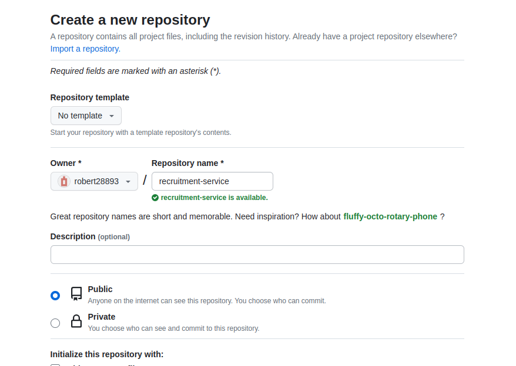
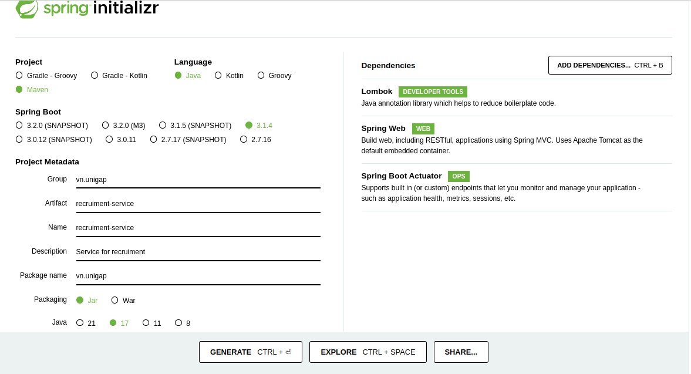
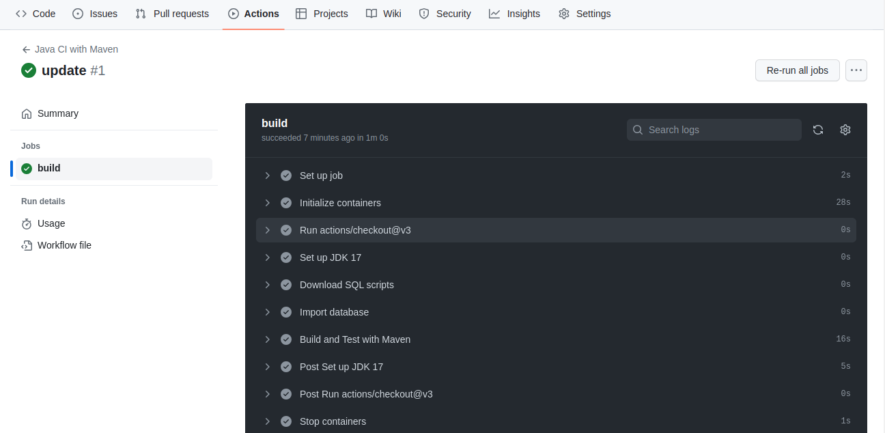
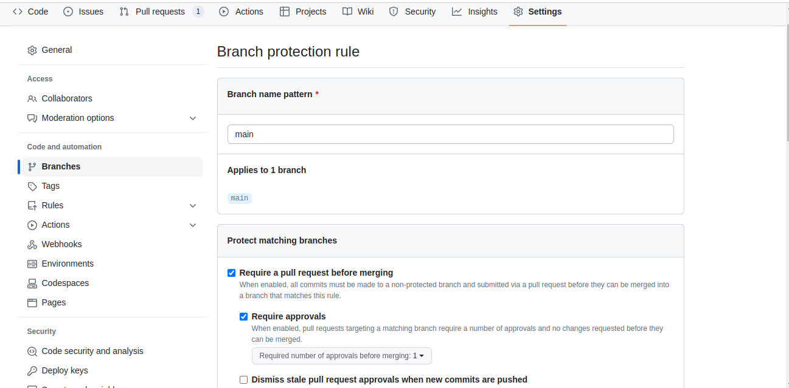
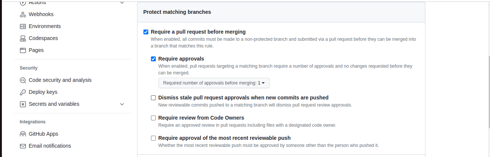
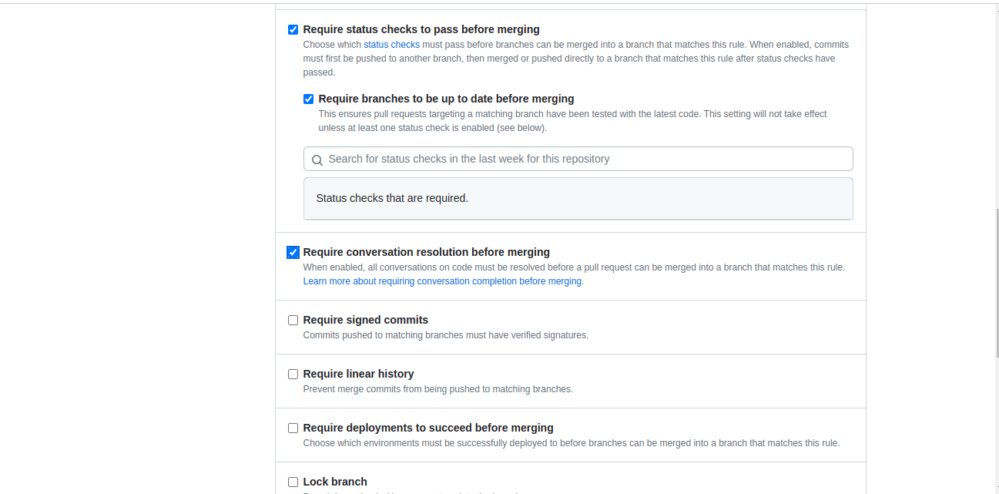

# Part 2

<!-- TOC -->
* [Part 2](#part-2)
  * [Overview](#overview)
  * [Khởi tạo project](#khởi-tạo-project)
    * [Tạo repository trên github](#tạo-repository-trên-github)
    * [Khởi tạo project bằng công cụ spring initializr](#khởi-tạo-project-bằng-công-cụ-spring-initializr)
    * [Đẩy source code lên `github`](#đẩy-source-code-lên-github)
    * [Cài đặt `Branch protection rules` cho repository](#cài-đặt-branch-protection-rules-cho-repository)
  * [Làm quen với Spring Framework](#làm-quen-với-spring-framework)
<!-- TOC -->

## Overview

Trong phần này chúng ta sẽ làm các công việc sau:

- Tạo và cài đặt `repository` trên github.
- Tìm hiểu cách khởi tạo 1 project Spring sử dụng công cụ Spring initializr.
- Sau đó thực hiện đẩy source code của dự án lên github.
- Cuối cùng chúng ta tìm hiểu về Spring framework bằng cách tham gia 1 vài courses trước khi bắt tay vào xây dựng
  project ở các phần sau.

## Khởi tạo project

### Tạo repository trên github

Bạn tạo `repository` trên github và nhập các thông tin như sau:



Các tham số còn lại đề mặc định và nhấn `Create repository`.

### Khởi tạo project bằng công cụ spring initializr

Truy cập vào đường dẫn sau [spring-initializr](https://start.spring.io/) và cấu hình các tham số như trong ảnh.



Chọn `Generate` và tải file zip về, sau đó thực hiện giải nén.

Tiếp theo bạn tạo thêm file với đường dẫn và nội dung như sau:

`.github/workflows/ci-build.yml`

```yaml
name: Java CI with Maven

on:
  push:
    branches: [ "main" ]
  pull_request:
    branches: [ "main" ]

jobs:
  build:

    runs-on: ubuntu-latest

    services:
      mysql:
        image: mysql:8.0.33
        env:
          MYSQL_ROOT_PASSWORD: Admin@123
        ports:
          - 3306:3306
        options: --health-cmd="mysqladmin ping" --health-interval=10s --health-timeout=5s --health-retries=3
      redis:
        image: redis:7.2.1-alpine3.18
        env:
          REDIS_PASSWORD: Redis@123
        ports:
          - 6379:6379
      mongodb:
        image: mongodb/mongodb-community-server:7.0.1-ubuntu2204
        env:
          MONGO_INITDB_ROOT_USERNAME: root
          MONGO_INITDB_ROOT_PASSWORD: Mongo@123
        ports:
          - 27017:27017
        options: >-
          --health-cmd="mongosh mongodb://localhost:27017 --eval \"db.runCommand({ ping: 1 })\"" 
          --health-interval=10s 
          --health-timeout=5s 
          --health-retries=3 

    steps:
      - name: Import database mySQL
        run: |
          wget -O scripts.sql https://raw.githubusercontent.com/robert28893/java-coaching-lab/main/source/docker-compose/mysql/db-dumps/job_db.sql
          mysql -h 127.0.0.1 --port=3306 -u root -p"Admin@123" < scripts.sql 
      - name: Install Node.js
        uses: actions/setup-node@v3
        with:
          node-version: '18'
      - name: Setup database and user in mongodb
        run: |
          npm install -g mongosh
          mongosh mongodb://127.0.0.1:27017 -u root -p Mongo@123 --eval "use sample_db;" --eval "db.createUser({user: 'user', pwd: 'User123', roles : [{role: 'dbOwner', db: 'sample_db'}]});"
      - uses: actions/checkout@v3
      - name: Set up JDK 17
        uses: actions/setup-java@v3
        with:
          java-version: '17'
          distribution: 'temurin'
          cache: maven          
      - name: Build and Test with Maven
        env:
          SPRING_DATASOURCE_URL: 'jdbc:mysql://127.0.0.1:3306/job_db'
          SPRING_DATASOURCE_USERNAME: 'root'
          SPRING_DATASOURCE_PASSWORD: 'Admin@123'
          SPRING_JPA_HIBERNATE_DDLAUTO: 'none'
          SPRING_DATA_REDIS_HOST: '127.0.0.1'
          SPRING_DATA_REDIS_PORT: '6379'
          SPRING_DATA_REDIS_PASSWORD: 'Redis@123'
          SPRING_DATA_MONGODB_HOST: '127.0.0.1'
          SPRING_DATA_MONGODB_PORT: '27017'
          SPRING_DATA_MONGODB_USERNAME: 'user'
          SPRING_DATA_MONGODB_PASSWORD: 'User123'
          SPRING_DATA_MONGODB_DATABASE: 'sample_db'
        run: chmod +x mvnw && ./mvnw -B package --file pom.xml
```

### Đẩy source code lên `github`

Tại thư mục của dự án vừa tạo. Thực hiện các lệnh sau:

```sh
git init -b main
git add .
git commit -m "First commit"
git remote add origin <REMOTE_URL> # REMOTE_URL là link project trên `github` 
git push origin main
```

Sau khi push code thành công. Tại tab `Actions` trên github bạn sẽ thấy kết quả `job` chạy thành công như sau:



### Cài đặt `Branch protection rules` cho repository

Tiếp theo bạn tiến hành cài đặt `Branch protection rules` cho `repository` trên github

Vào `settings->branches` chọn `Add rule`

Tại `Branch name pattern` nhập `main`



Tiếp theo phần `Protect matching branches` các bạn tích vào các phần sau:





Các phần còn lại để mặc định và nhấn `save`.

## Làm quen với Spring Framework

Trước khi bắt tay vào xây dựng project, chúng ta cùng tìm hiểu về Spring framework thông qua một vài courses sau.

1. [Learn Spring fundamentals and controllers](https://www.codecademy.com/enrolled/courses/learn-spring-fundamentals-and-controllers)
2. [Learn Spring building an app](https://www.codecademy.com/enrolled/courses/learn-spring-building-an-app)