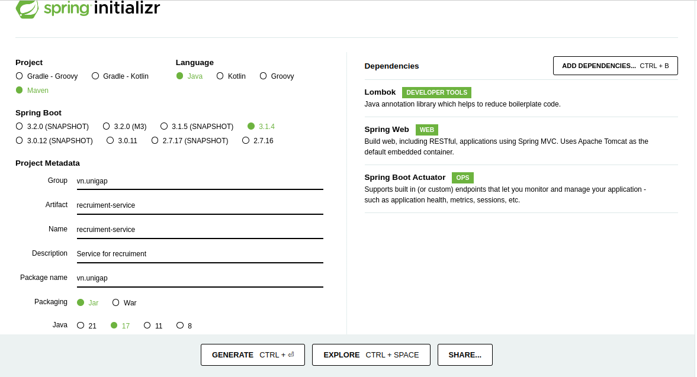

# Sprint 2

<!-- TOC -->
* [Sprint 2](#sprint-2)
  * [Overview](#overview)
  * [Khởi tạo project](#khởi-tạo-project)
    * [Khởi tạo project bằng công cụ spring initializr](#khởi-tạo-project-bằng-công-cụ-spring-initializr)
    * [Cấu hình git cho dự án và đẩy lên `gitlab`](#cấu-hình-git-cho-dự-án-và-đẩy-lên-gitlab)
  * [Làm quen với Spring Framework](#làm-quen-với-spring-framework)
<!-- TOC -->

## Overview

Trong sprint này chúng ta sẽ làm các công việc sau:

- Tìm hiểu cách khởi tạo 1 project Spring sử dụng công cụ Spring initializr.
- Sau đó thực hiện đẩy source code của dự án lên github.
- Cuối cùng chúng ta tìm hiểu về Spring framework bằng cách tham gia 1 vài courses trước khi bắt tay vào xây dựng
  project ở các Sprint sau.

## Khởi tạo project

### Khởi tạo project bằng công cụ spring initializr

Truy cập vào đường dẫn sau [spring-initializr](https://start.spring.io/) và cấu hình các tham số như trong ảnh.



Chọn `Generate` và tải file zip về, sau đó thực hiện giải nén.

### Cấu hình git cho dự án và đẩy lên `github`

Tại thư mục của dự án vừa tạo. Thực hiện các lệnh sau

```sh
git init -b main # hoặc git init && git symbolic-ref HEAD refs/heads/main
git add .
git commit -m "First commit"
git remote add origin <REMOTE_URL> # REMOTE_URL là link project trên `gitlab` 
git push origin main
```

Tiếp theo bạn tiến hành cài đặt `Branch protection rules`


## Làm quen với Spring Framework

Trước khi bắt tay vào xây dựng project, chúng ta cùng tìm hiểu về Spring framework thông qua một vài courses sau.

1. [Learn Spring fundamentals and controllers](https://www.codecademy.com/enrolled/courses/learn-spring-fundamentals-and-controllers)
2. [Learn Spring building an app](https://www.codecademy.com/enrolled/courses/learn-spring-building-an-app)