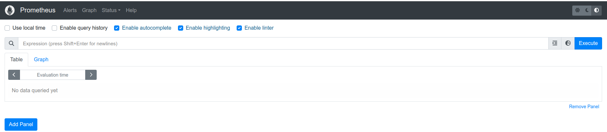
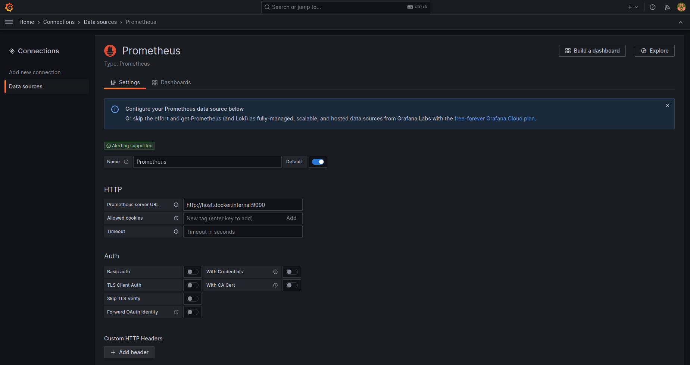
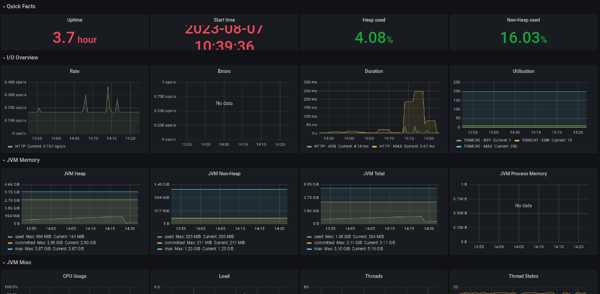
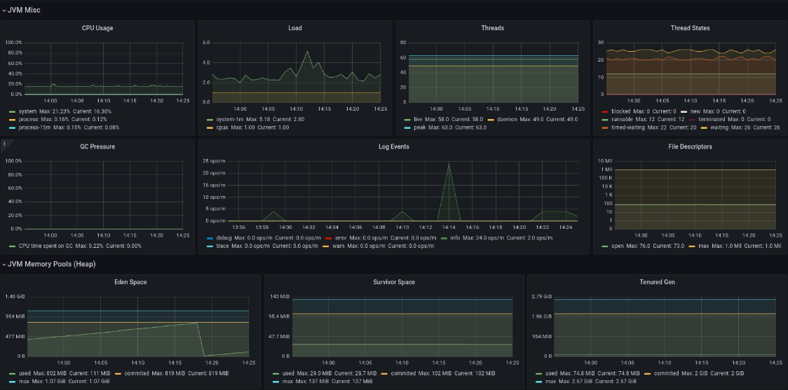
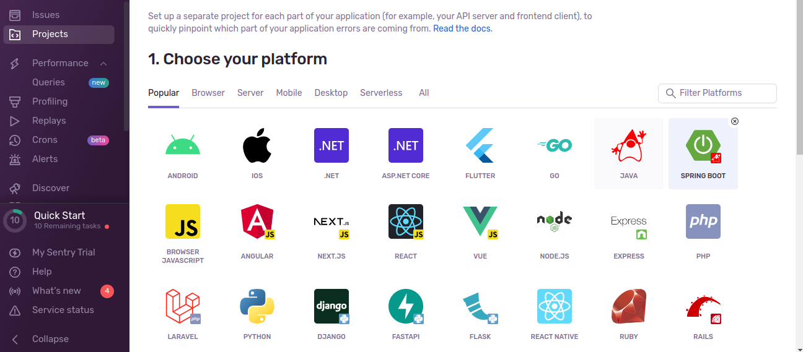
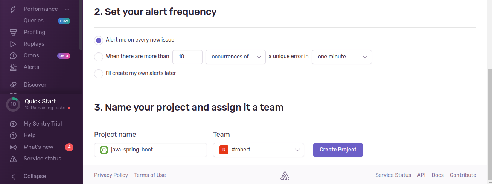
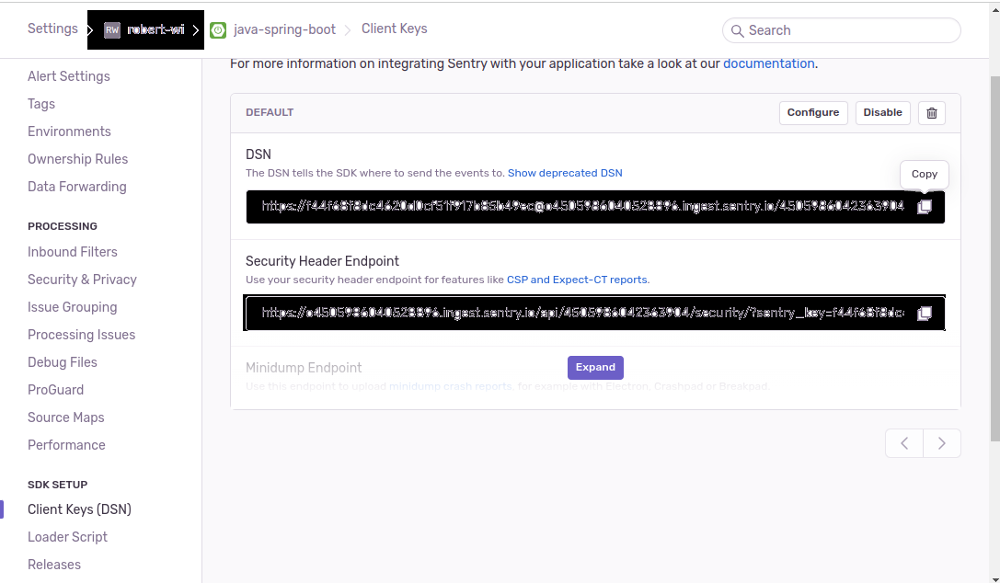
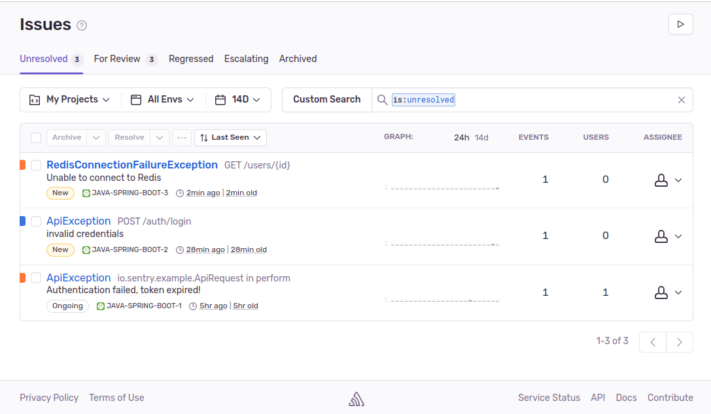

# Part 8

<!-- TOC -->
* [Part 8](#part-8)
  * [Overview](#overview)
  * [Prometheus](#prometheus)
  * [Grafana](#grafana)
  * [Spring Actuator](#spring-actuator)
  * [Sentry](#sentry)
    * [1. Đăng ký và cài đặt project trên Sentry](#1-đăng-ký-và-cài-đặt-project-trên-sentry)
    * [2. Kết nối spring vói sentry](#2-kết-nối-spring-vói-sentry)
<!-- TOC -->

## Overview

Trong phần này, bạn sẽ thêm `monitoring` cho dự án của bạn. Các tham số monitoring gồm các thông số như memory, cpu,
threads, received requests, ...

Công cụ sử dụng bao gồm: `prometheus`, `grafana` và module `spring-actuator`.

Kế đến bạn sẽ sử dụng công cụ `sentry` để giám sát các exceptions.

## Prometheus

Thực hiện việc start prometheus bằng docker compose theo hướng dẫn tại thư mục sau
[docker-compose/prometheus](../../source/docker-compose/prometheus)

Trong đó lưu ý file config `prometheus.yml` có nội dung như sau

```yml
scrape_configs:
  - job_name: 'Spring Boot Application'
    metrics_path: '/actuator/prometheus'
    scrape_interval: 15s
    static_configs:
      - targets: [ 'host.docker.internal:8080' ]
        labels:
          application: 'My Spring Boot Application'
```

Trường `targets` trỏ vào địa chỉ service của bạn.

Sau khi start prometheus, bạn vào giao diện console được kết quả như sau:



## Grafana

Với `grafana`, các bạn làm theo hướng dẫn trong thư mục [docker-compose/grafana](../../source/docker-compose/grafana)

Sau đó, tại trang console của `grafana` bạn thêm data source là prometheus như sau:



Tham khảo:

[Grafana Dashboards for Spring](https://grafana.com/grafana/dashboards/?search=spring)

## Spring Actuator

Trong phần này bạn sẽ sử dụng module `spring-actuator` để monitor ứng dụng của bạn. Spring Actuator cung cấp các thông
số về auditing, health và metrics.

Công việc của bạn bao gồm:

- [ ] Thêm dendencies cho module `spring-actuator` và `micrometer-prometheus`

```
<dependency>
    <groupId>org.springframework.boot</groupId>
    <artifactId>spring-boot-starter-actuator</artifactId>
</dependency>
<dependency>
    <groupId>io.micrometer</groupId>
    <artifactId>micrometer-registry-prometheus</artifactId>
</dependency>
```

- [ ] Cấu hình expose endpoints trong file `application.yml`

```yml
management:
  endpoints:
    web:
      exposure:
        include: '*'
```

- [ ] Start lại project và truy cập vào link sau để xem các metrics được expose cho prometheus

[http://localhost:8080/actuator/prometheus](http://localhost:8080/actuator/prometheus)

- [ ] Tiếp theo bạn vào giao diện console của `grafana` và thêm dashboard grafana cho spring. Kết quả thu được như sau:





Tham khảo:

- [https://docs.spring.io/spring-boot/docs/current/reference/html/actuator.html](https://docs.spring.io/spring-boot/docs/current/reference/html/actuator.html)
- [https://www.baeldung.com/spring-boot-actuators](https://www.baeldung.com/spring-boot-actuators)
- [https://www.masterspringboot.com/spring-boot-actuator/monitoring-spring-boot-with-micrometer-and-prometheus/](https://www.masterspringboot.com/spring-boot-actuator/monitoring-spring-boot-with-micrometer-and-prometheus/)
- [Sample Project](../../source/sample-project)

## Sentry

Sentry là một nền tảng theo dõi error, exception nhằm giúp các developers giám sát ứng dụng. Trong phần này bạn sẽ
đăng ký một tài khoản trên [sentry.io](https://sentry.io/), tạo một project trên sentry và sử dụng các cấu hình để kết
nối với spring cho việc theo dõi và giám sát các exception.

### 1. Đăng ký và cài đặt project trên Sentry

Truy cập vào link sau [link](https://sentry.io/signup/) và đăng ký một tài khoàn trên sentry.

Tiếp theo, bạn đăng nhập vào sentry và thực hiện thêm mới một project





### 2. Kết nối spring vói sentry

Thêm dependency

**pom.xml**

```
<dependency>
    <groupId>io.sentry</groupId>
    <artifactId>sentry-spring-boot-starter-jakarta</artifactId>
    <version>6.30.0</version>
</dependency>
```

Thêm cấu hình

**application.yml**

```yaml
sentry:
  dsn: link-dsn-of-sentry-project
```

Link dsn lấy trong mục settings -> client keys của project



Tiếp theo thực hiện việc capture các exception trong class `@ControllerAdvice`.

Với các mã lỗi `4xx` capture với event level là `INFO`, các mã lỗi `5xx` capture với event level là `ERROR`

Sau khi thực hiện kết quả thu được như sau:



Tham khảo:

- [Sample Project](../../source/sample-project)
