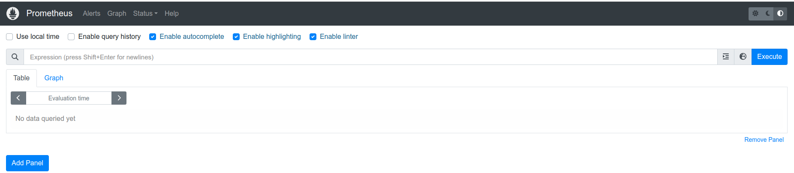
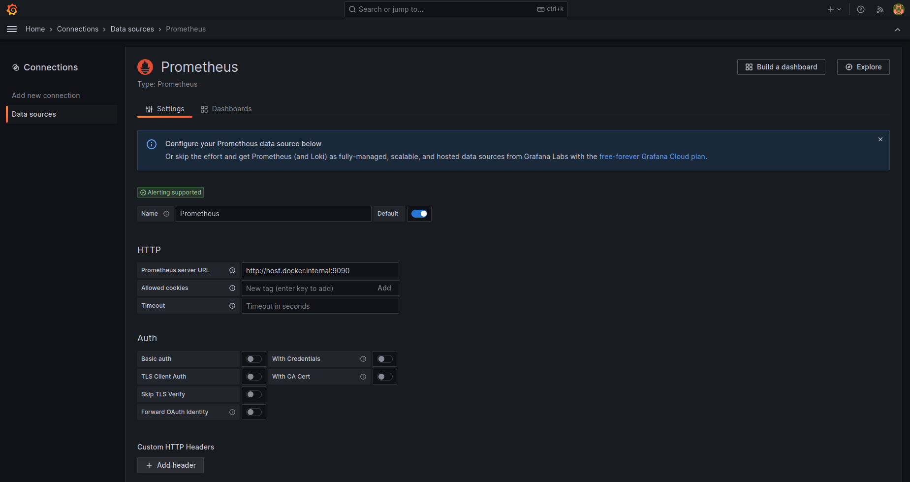
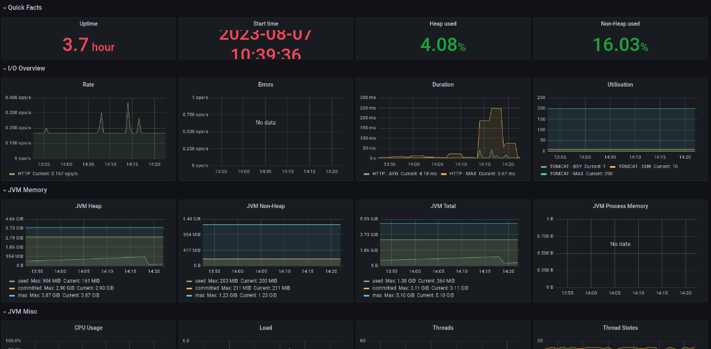
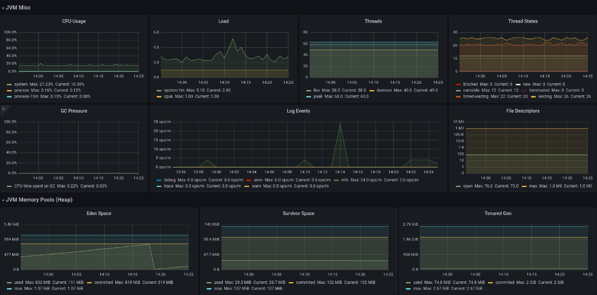

# Sprint 8

<!-- TOC -->
* [Sprint 8](#sprint-8)
  * [Overview](#overview)
  * [Prometheus](#prometheus)
  * [Grafana](#grafana)
  * [Spring Actuator](#spring-actuator)
<!-- TOC -->

## Overview

Trong sprint này, bạn sẽ thêm `monitoring` cho dự án của bạn. Các tham số monitoring gồm các thông số như memory, cpu,
threads,
received requests, ...

Công cụ sử dụng bao gồm: `prometheus`, `grafana` và module `spring-actuator`

## Prometheus

Thực hiện việc start prometheus bằng docker compose theo hướng dẫn tại thư mục sau
[docker-compose/prometheus](../../source/docker-compose/prometheus)

Trong đó lưu ý file config `prometheus.yml` có nội dung như sau

```yml
scrape_configs:
  - job_name: 'Spring Boot Application'
    metrics_path: '/actuator/prometheus'
    scrape_interval: 15s
    static_configs:
      - targets: [ 'host.docker.internal:8080' ]
        labels:
          application: 'My Spring Boot Application'
```

Trường `targets` trỏ vào địa chỉ service của bạn.

Sau khi start prometheus, bạn vào giao diện console được kết quả như sau:



## Grafana

Với `grafana`, các bạn làm theo hướng dẫn trong thư mục [docker-compose/grafana](../../source/docker-compose/grafana)

Sau đó, tại trang console của `grafana` bạn thêm data source là prometheus như sau:



Tham khảo:

[Grafana Dashboards for Spring](https://grafana.com/grafana/dashboards/?search=spring)

## Spring Actuator

Trong phần này bạn sẽ sử dụng module `spring-actuator` để monitor ứng dụng của bạn. Spring Actuator cung cấp các thông
số về auditing, health và metrics.

Công việc của bạn bao gồm:

- [ ] Thêm dendencies cho module `spring-actuator` và `micrometer-prometheus`

```
<dependency>
    <groupId>org.springframework.boot</groupId>
    <artifactId>spring-boot-starter-actuator</artifactId>
</dependency>
<dependency>
    <groupId>io.micrometer</groupId>
    <artifactId>micrometer-registry-prometheus</artifactId>
</dependency>
```

- [ ] Cấu hình expose endpoints trong file `application.yml`

```yml
management:
  endpoints:
    web:
      exposure:
        include: '*'
```

- [ ] Start lại project và truy cập vào link sau để xem các metrics được expose cho prometheus

[http://localhost:8080/actuator/prometheus](http://localhost:8080/actuator/prometheus)

- [ ] Tiếp theo bạn vào giao diện console của `grafana` và thêm dashboard grafana cho spring. Kết quả thu được như sau:





Tham khảo:

- [https://docs.spring.io/spring-boot/docs/current/reference/html/actuator.html](https://docs.spring.io/spring-boot/docs/current/reference/html/actuator.html)
- [https://www.baeldung.com/spring-boot-actuators](https://www.baeldung.com/spring-boot-actuators)
- [https://www.masterspringboot.com/spring-boot-actuator/monitoring-spring-boot-with-micrometer-and-prometheus/](https://www.masterspringboot.com/spring-boot-actuator/monitoring-spring-boot-with-micrometer-and-prometheus/)
- [Sample Project](../../source/sample-project)