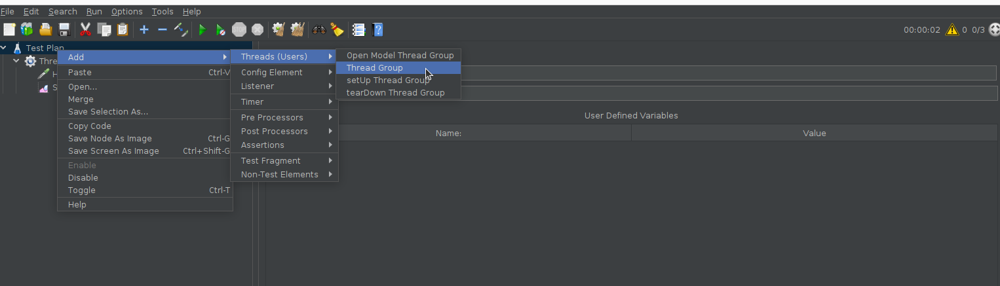
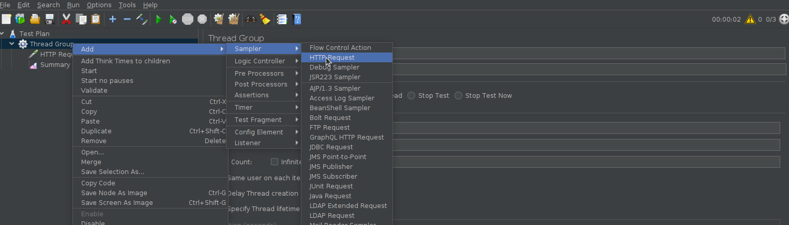
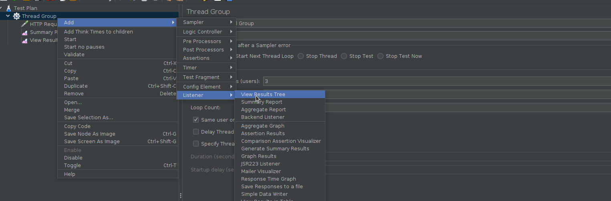
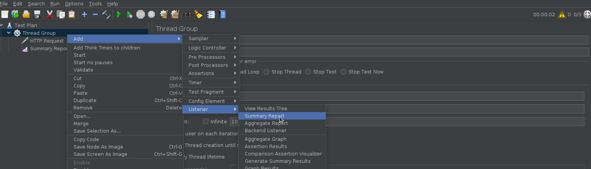
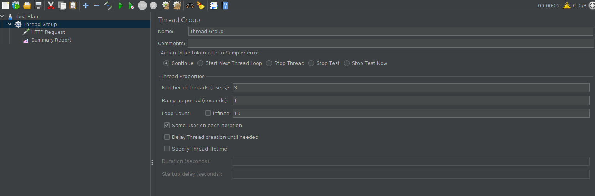
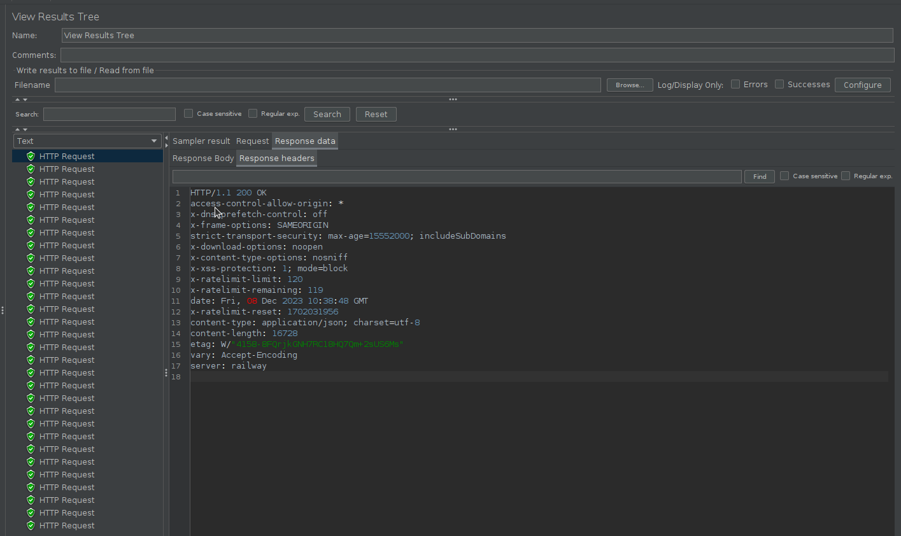
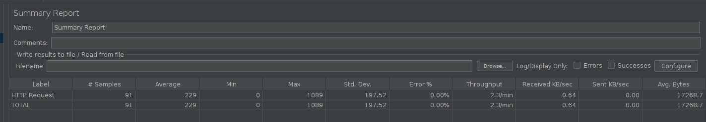

# Part 9

<!-- TOC -->
* [Part 9](#part-9)
  * [Overview](#overview)
  * [Mongodb](#mongodb)
    * [Cài đặt `Mongodb`](#cài-đặt-mongodb)
    * [Kết nối `Spring` với `Mongodb`](#kết-nối-spring-với-mongodb)
    * [Lưu log request, response của API vào trong `mongodb`](#lưu-log-request-response-của-api-vào-trong-mongodb)
  * [Docker: build and run](#docker-build-and-run)
    * [Dockerfile and building image](#dockerfile-and-building-image)
    * [Run image](#run-image)
      * [Sử dụng command line](#sử-dụng-command-line)
      * [Sử dụng docker compose file](#sử-dụng-docker-compose-file)
  * [Jmeter](#jmeter)
    * [Install](#install)
    * [Cấu hình và thực thi kịch bản kiểm thử hiệu năng](#cấu-hình-và-thực-thi-kịch-bản-kiểm-thử-hiệu-năng)
    * [Xem kết quả](#xem-kết-quả)
    * [Thực hành](#thực-hành)
  * [Tham khảo](#tham-khảo)
<!-- TOC -->

## Overview

Trong phần này bạn sẽ tìm hiểu cách thức kết nối `spring` với `mongodb` và thực hành với việc lưu log request, response
của api vào trong `mongodb`.

Tiếp theo, cùng tìm hiểu việc đóng gói chương trình thành image docker và chạy chương trình của bạn như một container
trong `docker`.

## Mongodb

### Cài đặt `Mongodb`

Bạn thực hiện việc cài đặt Mongodb server và Mongo compass theo hướng dẫn trong thư mục sau
[docker-compose/mongodb](../../source/docker-compose/mongo).

Tiếp theo bạn thêm mới 1 database tên là `sample_db` và tạo một user trên database này với các tham số sau
`user: 'user', pwd: 'User123', role: 'dbOwner'`

### Kết nối `Spring` với `Mongodb`

Thêm dependencies cho module spring-data-mongodb

```xml

<dependency>
    <groupId>org.springframework.boot</groupId>
    <artifactId>spring-boot-starter-data-mongodb</artifactId>
</dependency>
```

Bổ sung cấu hình trong file `application.yml`

```yml
spring:
  data:
    mongodb:
      host: "localhost"
      port: 27017
      username: "user" # use have to create this user
      password: "User123"
      database: "sample_db"
```

Tìm hiểu về cách làm việc với `spring-data-mongo`:

- [spring-data-mongodb-tutorial](https://www.baeldung.com/spring-data-mongodb-tutorial)

### Lưu log request, response của API vào trong `mongodb`

Tìm hiểu cách logging request, response trong `Spring` thông qua hướng dẫn sau:

- [Logging request and response](https://frandorado.github.io/spring/2018/11/15/log-request-response-with-body-spring.html)

Tiếp theo bạn cần định nghĩa document trong mongodb và lưu request, response vào trong mongodb.

Tham khảo:

- [Sample Project](../../source/sample-project)

## Docker: build and run

Trong phần này bạn sẽ tìm hiểu cách viết một file `Dockerfile` để build image cho một chương trình spring.
Cùng tìm hiểu cách build image trong docker với lệnh `docker build`.

Tiếp theo, bạn sẽ sử dụng image đã tạo được để chạy chương trình. Bạn sẽ tìm hiểu 2 cách để chạy 1 docker image: Sử dụng
lệnh `docker run` hoặc thông qua `docker-compose` file.

### Dockerfile and building image

Cùng tìm hiểu về `Dockerfile` tại link sau:
[Dockerfile best practices](https://docs.docker.com/develop/develop-images/dockerfile_best-practices/)

Tiếp theo, tìm hiểu cách viết một `Dockerfile` cho ứng dụng `spring`:
[Spring Boot Docker](https://spring.io/guides/topicals/spring-boot-docker/)

### Run image

#### Sử dụng command line

Tìm hiểu lệnh `docker run`: [docker run](https://docs.docker.com/engine/reference/run/)

#### Sử dụng docker compose file

[Compose file](https://docs.docker.com/compose/compose-file/03-compose-file/)

[Docker compose cli](https://docs.docker.com/compose/reference/)

## Jmeter

JMeter là một công cụ được sử dụng để thực hiện kiểm tra hiệu năng và tải trên các ứng dụng web. 

Trong phần này bạn sẽ tìm hiểu cách cài đặt `jmeter`, cách cấu hình và thực thi kịch bản kiểm thử hiệu năng

### Install

Download jmeter tại link sau và thực hiện giải nén [link](https://jmeter.apache.org/download_jmeter.cgi)

Chạy bằng cách run file `jmeter.sh` trong thư mục `bin`

### Cấu hình và thực thi kịch bản kiểm thử hiệu năng

**Thêm ThreadGroup**



**Thêm HttpRequest**



**Thêm View Results Tree**



**Thêm Summary Report**



**Cấu hình tham số cho ThreadGroup**



**Cấu hình HttpRequest**


Lưu ý cấu hình các tham số cần thiết cho http request như method, path, parameters, ...

### Xem kết quả

Tiến hành chạy và thu được các kết quả như sau:

**View Results Tree**



**Summary Report**



### Thực hành

Hãy áp dụng vào việc kiểm thử hiệu năng api `list employer` 

## Tham khảo

- [Sample Project](../../source/sample-project)