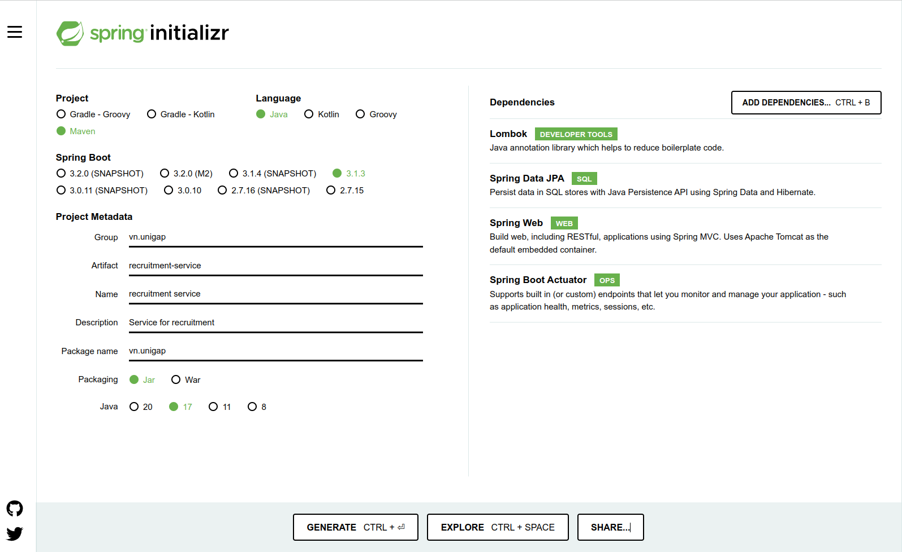

# Sprint 1

## Khởi tạo project

1. Khởi tạo project bằng công cụ spring initializr

Truy cập vào đường dẫn sau [spring-initailizr](https://start.spring.io/) và cấu hình các tham số như trong ảnh.



Chọn `Generate` và tải file zip về, sau đó thực hiện giải nén.

2. Cấu hình git cho dự án và đẩy lên github

Tại thư mục của dự án vừa tạo. Thực hiện các lệnh sau

```sh
git init -b main # hoặc git init && git symbolic-ref HEAD refs/heads/main
git add .
git commit -m "First commit"
git remote add origin <REMOTE_URL> # REMOTE_URL là link project trên github 
git push origin main
```

